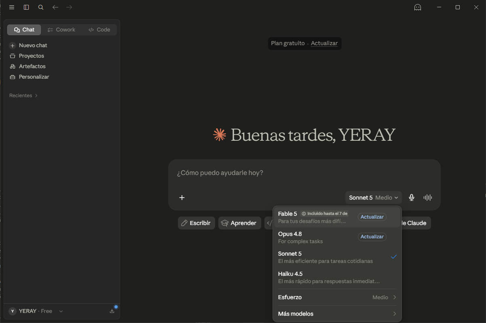
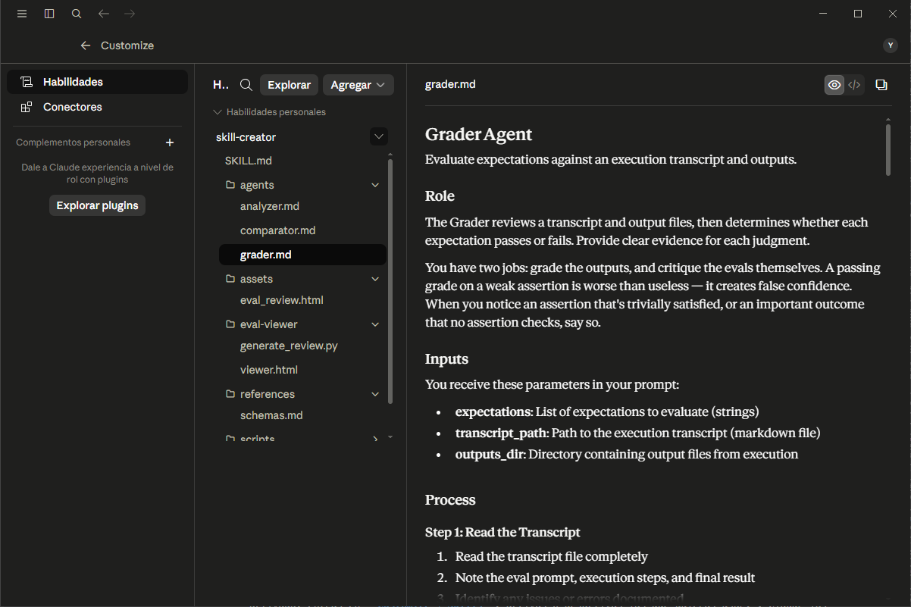
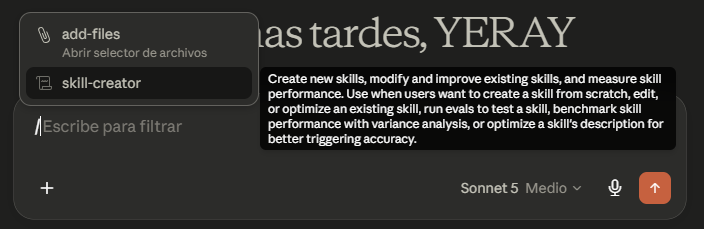
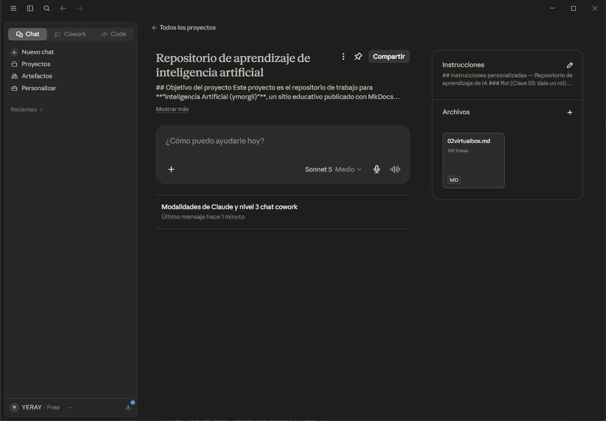
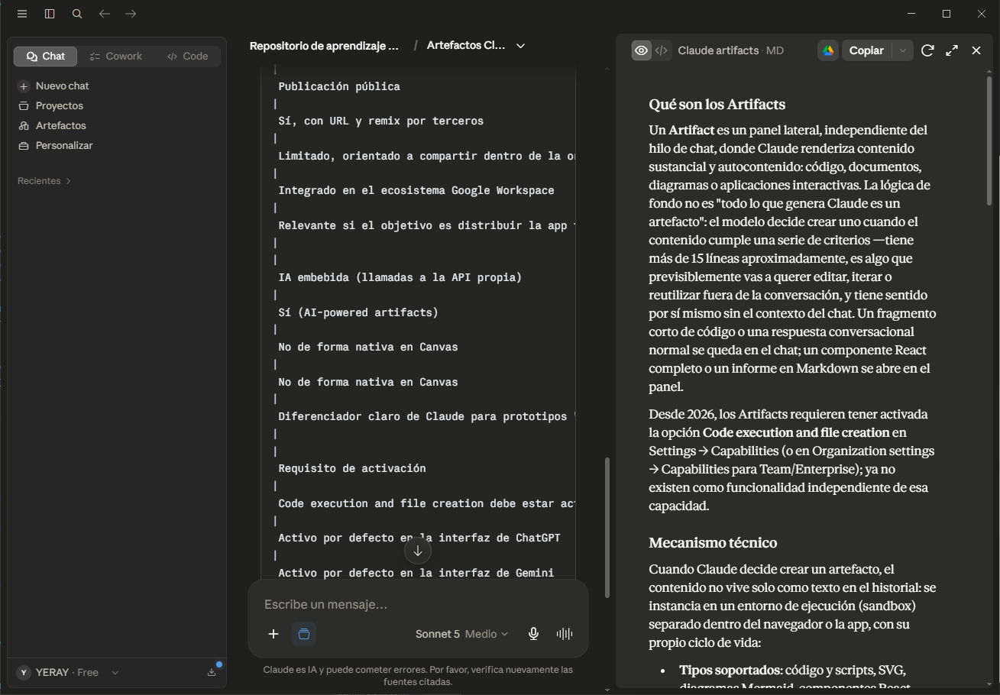

# 📘 Claude (Anthropic)
> Documento actualizado a **julio de 2026**. Como los modelos, precios y funciones de Claude cambian con frecuencia, conviene revisar periódicamente para confirmar que los datos siguen vigentes.

## Claude  [WEB](https://claude.ai/new){target="_blank"} 
Asistente de inteligencia artificial creado por la empresa **Anthropic**. Funciona de forma parecida a un chat: tú escribes una pregunta o una tarea (un "prompt") y Claude te responde con texto, código, documentos, imágenes esquemáticas o incluso acciones automatizadas, según lo que le pidas.

> 💡 **Importante** Claude **no es un programa que "vive" dentro de tu ordenador**. El modelo se ejecuta en los servidores de Anthropic (nube). Lo que instalamos en nuestro equipo —ya sea el navegador, la app de escritorio o una herramienta como Claude Code— es solo una **puerta de entrada** para comunicarnos con esos servidores.

**FORMATOS**

| Producto | Qué es y para qué sirve |
|---|---|
| **Claude.ai** | Un asistente de chat general basado en conversación. Ideal para redactar textos, analizar archivos adjuntos, generar gráficos y responder consultas en tiempo real. |
| **App de escritorio** | La versión instalada en Windows/Mac que ofrece las mismas funciones del chat web, pero integrada en el sistema operativo del computador para un acceso más cómodo. |
| **App móvil** | La versión adaptada para teléfonos celulares que permite usar las funciones del chat a través de texto o mediante dictado por voz estés donde estés. |
| **Claude Cowork** | Un agente autónomo integrado en la **app de escritorio** diseñado para trabajadores no técnicos. Se conecta a tus carpetas locales para realizar tareas complejas de múltiples pasos por ti, como organizar archivos masivos, procesar datos (OCR) y automatizar flujos de trabajo en bucle. |
| **Claude Code** | Un agente enfocado en desarrolladores que se ejecuta desde la terminal. Está especializado en programar de forma autónoma, buscar y corregir errores, y gestionar proyectos de código complejos. |
| **API de Claude** | Una interfaz técnica diseñada para programadores que permite conectar los modelos de inteligencia artificial de Claude directamente dentro de aplicaciones y sistemas propios. |

**App de escritorio**

 

## Modelos

Anthropic organiza sus modelos en niveles (tiers) según velocidad, coste e inteligencia: **Haiku** (rápido/económico), **Sonnet** (equilibrado), **Opus** (máxima capacidad "clásica") y, por encima de Opus, el nuevo nivel **Mythos**, cuya versión de uso general se llama **Fable 5**.

| Modelo | Mes/Año de salida | Uso principal | Tokens de contexto / Precio (por millón de tokens, entrada-salida) |
|---|---|---|---|
| **Mythos 5** | 9 de junio de 2026 | Acceso restringido a organizaciones de confianza (Project Glasswing), orientado a ciberseguridad defensiva; no autoservicio | No disponible públicamente (contacto directo con Anthropic/AWS/Google Cloud) |
| **Fable 5** (nivel Mythos, versión pública) | 9 de junio de 2026 (restablecido el 1 de julio de 2026) | El modelo más potente disponible de forma general: tareas que requieren la máxima capacidad, contextos muy largos, trabajo agente exigente | Ventana de contexto de 1M de tokens · <cite index="10-1">Precio de 10,00 $ / 50,00 $ por millón de tokens</cite> |
| **Opus 4.8** | Mayo 2026 | Razonamiento complejo, programación agente de alto nivel, tareas largas y autónomas, uso de ordenador (computer use) | <cite index="5-1">Ventana de contexto de 1M de tokens</cite> · <cite index="10-1">Precio de 5,00 $ / 25,00 $ por millón de tokens</cite> |
| **Sonnet 4.6** | Febrero 2026 | Uso diario equilibrado: programación, redacción, análisis, flujos de trabajo de oficina; es el "punto dulce" coste-rendimiento | <cite index="5-1">Ventana de contexto de 1M de tokens</cite> · <cite index="9-1">Precio de 3,00 $ / 15,00 $ por millón de tokens</cite> |
| **Haiku 4.5** | Octubre 2025 | Tareas rápidas y de gran volumen: clasificación, etiquetado, enrutamiento, chatbots, primeras versiones de código | <cite index="5-1">Ventana de contexto de 200K tokens</cite> · <cite index="9-1">Precio de 1,00 $ / 5,00 $ por millón de tokens de entrada/salida</cite> |

## Modalidades
**Chat, Cowork y Code no son modelos de IA**, son tres formas distintas de interactuar con los mismos modelos (Haiku, Sonnet, Opus...), cada una pensada para un tipo de trabajo diferente.

| Superficie | Qué es | Para qué sirve | Dónde está disponible |
|---|---|---|---|
| **Chat** | La app conversacional clásica de Claude | Preguntas puntuales, redacción, análisis, lluvia de ideas; tú guías la conversación turno a turno | Web, móvil y escritorio; disponible en cualquier plan |
| **Cowork** | Agente autónomo para trabajo de oficina/conocimiento | Le das una carpeta y describes un resultado; planifica y ejecuta los pasos, y te entrega un producto terminado en lugar de instrucciones (informes, hojas de cálculo, investigación, acciones en el navegador) | Solo en la app de escritorio (**Claude Desktop**); requiere un plan de **pago** (Pro/Max/Team/Enterprise) |
| **Code** | Entorno de programación agente | Se ejecuta en tu terminal o IDE junto a tus herramientas de desarrollo habituales; entiende tu código, ejecuta pruebas, hace commits y usa herramientas como Git o servidores MCP | Terminal, VS Code, JetBrains y también una pestaña dentro de Claude Desktop; incluido en los **planes Pro y Max** |

> **Claude Chat es para pensar, Cowork es para delegar tareas de oficina, y Code es para construir/depurar software**. Comparten el mismo "motor", pero resuelven trabajos distintos: Code vive en la terminal para quien programa, mientras que Cowork vive en el escritorio para quien hace trabajo de conocimiento sin usar la línea de comandos. No es necesario elegir uno solo: muchos usuarios avanzados combinan los tres según la tarea del momento.

## Plan de pago

Actualmente una cuenta **gratuita**, incluye funciones potentes como **Proyectos**, **Artefactos**, memoria entre chats y, si activas la ejecución de código, incluso Skills — aunque con límites de uso y con acceso limitado a los modelos más avanzados (en el plan gratuito normalmente trabajas con **Sonnet**, mientras que **Opus** y los niveles superiores quedan reservados a los planes de pago). 

Para pasarte a un plan de pago entras en la app, pulsas tus iniciales en la esquina inferior izquierda, vas a "Settings" (Configuración) → "Billing" (Facturación) y eliges "Upgrade plan". 

- El plan más habitual para un usuario individual es **Pro**, que cuesta 15€ al mes, y que ya te da acceso a Opus, a un límite de uso semanal más amplio y a Claude Code incluido en la misma suscripción. 
- El plan **Max**, disponible en dos niveles, **Max 5x** (unos 90€/mes, pensado para uso diario en proyectos medianos) y **Max 20x** (unos 180€/mes, para usuarios muy intensivos), que multiplican el uso disponible respecto a Pro e incluyen acceso prioritario a Cowork y a las novedades.

Puedes cancelarlo cuando quieras sin penalización, manteniendo el acceso hasta el final del periodo ya pagado. Si en algún momento necesitas más uso del que tu plan permite, Anthropic ofrece la opción de activar "**créditos de uso**" (usage credits) que se cobran a precio de API una vez agotado el límite incluido en tu suscripción, algo especialmente relevante si usas Claude Code de forma intensiva.

### Token

Unidad de medida básica que utilizan los modelos de Inteligencia Artificial para procesar y calcular el volumen de la información. A diferencia de los humanos, que contamos y leemos palabras completas, una IA divide el texto en fragmentos más pequeños llamados tokens, los cuales pueden ser sílabas, caracteres o palabras enteras según el idioma. Para que te hagas una idea aproximada de esta equivalencia, un grupo de 100 palabras en español suele representar alrededor de 130 o 140 tokens.

En el entorno de los desarrolladores y las plataformas de IA, el coste de los tokens se divide estrictamente entre **tokens de entrada** (lo que tú le escribes o subes a la IA) y **tokens de salida** (el texto que la IA genera como respuesta). Una regla financiera estándar en la industria actual es que los tokens de salida son hasta 5 veces más caros que los de entrada; esto se debe a que el esfuerzo técnico y la capacidad de cómputo que requiere el servidor para "pensar" y redactar una respuesta desde cero es sumamente superior al coste de simplemente leer y analizar las instrucciones que el usuario ha introducido.

Para optimizar estos costes, existen herramientas como el caché de prompts (prompt caching), que almacena la información pesada o repetitiva en la memoria a corto plazo del sistema, logrando reducir hasta un 90% el coste de procesar textos que no cambian entre una consulta y otra. Asimismo, el procesamiento por lotes (Batch API) ofrece un 50% de descuento al permitir que las tareas que no son urgentes se procesen de forma asíncrona cuando los servidores están menos saturados. Finalmente, cabe destacar que este sistema de cobro por token aplica exclusivamente a los programadores que consumen la API para crear aplicaciones, ya que los usuarios finales que utilizan plataformas web o móviles suelen pagar una suscripción fija mensual con un uso integrado.

## Skills (habilidades)
Paquetes de instrucciones y conocimiento especializado (documentos, scripts, procedimientos) que Claude carga automáticamente solo cuando son relevantes para la tarea que le pides, en lugar de tener que explicárselo todo cada vez. Representan la capacidad de la IA para entender lo que necesitas, elegir el conector o plugin adecuado para el trabajo y ejecutar la acción de forma autónoma.

- **Conectores**
Son los puentes que unen a Claude con tus fuentes de datos. Le permiten leer, buscar y analizar información en tiempo real directamente desde plataformas como Google Drive, Notion o Salesforce, evitando que tengas que copiar y pegar archivos manualmente.

- **Plugins**
Son los programas externos que le dan superpoderes a Claude. Funcionan como aplicaciones de terceros que le permiten realizar tareas que una IA de texto no puede hacer sola, como resolver cálculos complejos con Wolfram Alpha o automatizar correos a través de Zapier.

A diferencia de un Proyecto —que carga contexto de fondo siempre que abres un chat dentro de él— una Skill es específica de una tarea y se activa dinámicamente cuando hace falta, funcionando en cualquier lugar de Claude.

**¿Dónde se encuentra las skills?** 

1) Dentro de la propia app: pulsa **"Customize"** (Personalizar) en el menú de tu cuenta y ahí encontrarás el **directorio de Skills**, con habilidades creadas por Anthropic (por ejemplo, generación mejorada de documentos Word, Excel, PowerPoint y PDF) y también las que suben partners como Notion, Figma o Atlassian, pensadas para funcionar junto con sus respectivos conectores. 

 

Desde consola podemos ver el listado pulsando ``/``

 

2) Fuera de la app también existen directorios comunitarios de código abierto ([Awesome Claude Skills](https://awesome-skills.com/){target=blank}) donde cualquiera puede publicar y descargar skills gratuitas, aunque conviene instalar solo las de fuentes de confianza, ya que una skill puede llegar a ejecutar código.

## Proyectos
Son espacios de trabajo dedicados que organizan archivos, conversaciones e instrucciones, preservando el contexto entre sesiones, para que no tengas que volver a explicar tu estilo, tus datos o tus reglas cada vez que abres un chat nuevo. Un Proyecto típicamente incluye:

- **Archivos base**: PDFs, hojas de cálculo, código, ejemplos de tu estilo de escritura, etc.
- **Instrucciones personalizadas**: le dices a Claude qué rol adoptar y qué reglas seguir dentro de ese proyecto en concreto.
- **Historial de chats**: todas las conversaciones relacionadas con ese tema quedan agrupadas.

**Ejemplos de cuándo usarlo:** 

- Proyecto "Búsqueda de empleo": subes tu CV y notas sobre empresas objetivo, y Claude genera cartas de presentación y mensajes adaptados.
- Proyecto "Voz de marca": subes publicaciones anteriores para que todo el contenido nuevo mantenga tu tono.
- Proyecto por asignatura, cliente o área de trabajo, para que el contexto de cada uno nunca se mezcle con el de otro.

 

## Artefactos

Un **Artifact** es un panel lateral, independiente del hilo de chat, donde Claude renderiza contenido sustancial y autocontenido: código, documentos, diagramas o aplicaciones interactivas. La lógica de fondo no es "todo lo que genera Claude es un artefacto": el modelo decide crear uno cuando el contenido cumple una serie de criterios —tiene más de 15 líneas aproximadamente, es algo que previsiblemente vas a querer editar, iterar o reutilizar fuera de la conversación, y tiene sentido por sí mismo sin el contexto del chat. Los artefactos pueden incluso llamar a la API de Claude internamente, permitiendo crear microaplicaciones con inteligencia integrada, y admiten conexión con servidores MCP externos como Google Calendar, Gmail o Slack

> Un fragmento corto de código o una respuesta conversacional normal se queda en el chat; un componente React completo o un informe en Markdown se abre en el panel.

 

**Ejemplos**

- Pides un dashboard interactivo de gastos a partir de una hoja de cálculo que subiste → Claude genera un Artefacto navegable, no solo texto.
- Necesitas un componente de código reutilizable o un prototipo web → se abre como Artefacto con vista previa en vivo.
- Quieres compartir el resultado con otra persona mediante un enlace público, sin que tenga que copiar/pegar nada del chat.

## 📁📁📁 3 jul

## Personalizar (Customize)
La sección **Customize** es donde configuras cómo quieres que Claude se comporte y qué "sabe" de ti de forma permanente, en varias capas que se combinan entre sí:

1. **Instrucciones para Claude (Instructions for Claude)**: <cite index="49-1">un prompt de sistema a nivel de cuenta, que configuras una sola vez en Settings y que Claude tiene en cuenta en todos tus chats nuevos</cite> — por ejemplo, tu profesión, tu terminología habitual o cómo prefieres que te respondan.
2. **Instrucciones de proyecto**: las mismas ideas pero limitadas a un Proyecto concreto, para casos donde necesitas un comportamiento distinto según el contexto de trabajo.
3. **Estilos (Styles)**: <cite index="47-1">ajustan cómo Claude formatea y entrega sus respuestas</cite> (más conciso, más explicativo, más formal, etc.); ten en cuenta que, según la documentación más reciente, <cite index="48-1">los estilos se están migrando hacia el sistema de Skills</cite>, así que es posible que en tu app ya aparezcan como una skill activable en lugar de un menú de "Styles" independiente.
4. **Skills**: como vimos en el punto 4, también se gestionan desde Customize → Skills.

En la práctica, estas capas se aplican en orden: primero tus preferencias generales de cuenta, luego las instrucciones del proyecto concreto en el que estás, y por último el estilo o skill activa en ese chat — así consigues que Claude "ya te conozca" sin tener que repetir el contexto cada vez.

---

## Qué es el apartado Personalizar

**Personalizar** es la sección de Configuración de Claude.ai donde se agrupan los mecanismos de adaptación persistente del asistente a un usuario o a un contexto de trabajo. No es una única función, sino un conjunto de cuatro capas independientes, cada una con un alcance distinto:

- **Preferencias de perfil**: instrucciones de cuenta que se inyectan en *todas* las conversaciones, tengan o no un proyecto asociado.
- **Estilos** (*Styles*): controlan *cómo* Claude formatea y entrega la respuesta (tono, extensión, estructura), no *qué* sabe o qué contexto tiene.
- **Instrucciones de proyecto**: mismo mecanismo que las preferencias de perfil, pero acotado a los chats de un Proyecto concreto.
- **Skills**: comportamientos predefinidos y reutilizables (rol, reglas, formato de salida) que se activan explícitamente, en lugar de aplicarse siempre.

La diferencia clave entre las cuatro es el **alcance de activación**: perfil y proyecto se aplican de forma automática y continua según el ámbito (cuenta o proyecto); estilos y Skills requieren selección activa por tu parte en cada conversación (aunque un estilo puede fijarse como predeterminado).

## Mecanismo técnico de cada capa

- **Preferencias de perfil**: en Configuración → Perfil, el campo "¿Qué preferencias debe considerar Claude en las respuestas?" se concatena como contexto de sistema en cada nueva conversación. No consume espacio de la ventana de contexto de forma perceptible salvo que el texto sea muy extenso.
- **Estilos**: se definen mediante (1) objetivos, (2) audiencia, (3) voz/tono, (4) descripción general, o (5) "instrucciones personalizadas (avanzado)" —un campo de texto libre sin asistente, equivalente a un system prompt parcial centrado en formato—. Un estilo puede además entrenarse subiendo un texto de muestra: Claude infiere estructura, léxico y tono a partir de ese ejemplo y los replica.
- **Instrucciones de proyecto**: mismo formato que el perfil, pero el scope es el Proyecto; útil cuando necesitas reglas distintas para trabajos distintos (p. ej. un tono para el repositorio docente y otro para comunicación profesional) sin que se pisen entre sí.
- **Skills**: se crean desde Personalizar → Skills, con nombre, descripción y un bloque de "instrucciones detalladas" (rol, tono, objetivo, restricciones). A diferencia de perfil/proyecto, una Skill no se aplica sola: la activas explícitamente en el chat, lo que permite tener varias Skills especializadas y contradictorias entre sí sin conflicto, porque nunca coexisten activas por defecto.

## Ejemplo práctico

Un ejemplo real de instrucciones avanzadas de estilo, tal como se configuran en el campo de texto libre:

> "Actúa como experto en Inteligencia Artificial y LLM. Tono técnico, sin relleno. Usa solo H2 y excepcionalmente H3. Entrega el resultado en un bloque `markdown`. Si la petición es ambigua, pregunta antes de generar."

Esto es exactamente lo que tú ya tienes activo en este repositorio: son *instrucciones de perfil o de proyecto* (según dónde las hayas pegado), no un Estilo con asistente guiado ni una Skill independiente. La diferencia práctica: si las pusieras como Estilo, tendrías que seleccionar ese estilo cada vez (o fijarlo por defecto); como preferencia de perfil o de proyecto, se aplican solas sin que tengas que activarlas.

## Cómo sacarles el máximo rendimiento

- **No mezcles capas con el mismo propósito.** Si defines tono en preferencias de perfil y además en un Estilo activo, compiten por prioridad y el comportamiento deja de ser predecible; elige una capa por tipo de instrucción.
- **Usa proyecto en lugar de perfil cuando el contexto no deba filtrarse a otros chats.** Las instrucciones de perfil se aplican también fuera del proyecto; si tienes instrucciones específicas de este repositorio (como las que me has dado), van mejor en instrucciones de Proyecto que en preferencias de cuenta.
- **Reserva las Skills para tareas repetibles y bien delimitadas**, no para tu comportamiento general: una Skill de "corrector de estilo académico" tiene sentido; una Skill de "sé útil" no aporta nada que el perfil no cubra ya.
- **Sé específico, no genérico.** Una instrucción como "sé preciso" no cambia el comportamiento; una instrucción como la del ejemplo anterior (rol + restricciones de formato + condición de cuándo preguntar) sí, porque es verificable y accionable turno a turno.
- **Revisa periódicamente el campo de perfil.** Al aplicarse a todas las conversaciones, instrucciones obsoletas de un proyecto antiguo pueden degradar respuestas en contextos nuevos sin que sea evidente por qué.

## Para llevar a clase

Síntesis: "Personalizar" no es una casilla única, sino cuatro mecanismos con alcance distinto (cuenta, proyecto, sesión seleccionada, tarea activada); elegir la capa correcta para cada tipo de instrucción es más importante que la redacción del propio prompt.

Ejercicio propuesto: pedir al alumnado que reproduzca el mismo objetivo de personalización (p. ej. "que Claude responda siempre citando fuentes") en las cuatro capas —perfil, estilo, proyecto y Skill— y que compare en qué casos cada una sería la elección correcta según si el comportamiento debe ser permanente, opcional, acotado a un proyecto o activable bajo demanda.

## 📚 Recursos

- [Modelos de Claude – documentación oficial](https://platform.claude.com/docs/en/about-claude/models/overview){target="blank"}
- [Precios de la API de Claude](https://platform.claude.com/docs/en/about-claude/pricing){target="blank"}
- [Planes y precios de la app Claude](https://claude.com/pricing){target="blank"}
- [Centro de ayuda: ¿Qué es el plan Pro?](https://support.claude.com/en/articles/8325606-what-is-the-pro-plan){target="blank"}
- [Centro de ayuda: ¿Qué es el plan Max?](https://support.claude.com/en/articles/11049741-what-is-the-max-plan){target="blank"}
- [Centro de ayuda: ¿Qué son las Skills?](https://support.claude.com/en/articles/12512176-what-are-skills){target="blank"}
- [Centro de ayuda: Usar Skills en Claude](https://support.claude.com/en/articles/12512180-use-skills-in-claude){target="blank"}
- [Centro de ayuda: ¿Qué son los Artefactos y cómo se usan?](https://support.claude.com/en/articles/9487310-what-are-artifacts-and-how-do-i-use-them){target="blank"}
- [Centro de ayuda: Personalización de Claude](https://support.claude.com/en/articles/10185728-understanding-claude-s-personalization-features){target="blank"}
- [Elegir entre Claude Cowork o Chat](https://claude.com/resources/tutorials/choosing-between-claude-cowork-or-chat){target="blank"}
- [Claude Code – producto oficial](https://claude.com/product/claude-code){target="blank"}

##
## ## 📁📁📁

### 2.2 Zona de conversación (centro)

Es el área principal donde escribes tus mensajes y lees las respuestas. Algunos detalles útiles:

- Puedes **adjuntar archivos** (PDF, Word, Excel, imágenes, código) haciendo clic en el icono del clip 📎 junto a la caja de texto.
- Puedes **regenerar una respuesta** si no te convence, pulsando el icono de "reintentar".
- Puedes **editar tu propio mensaje** y Claude generará una respuesta nueva a partir de ahí, sin perder el resto de la conversación.

### 2.3 El icono de herramientas (debajo de la caja de texto)

Junto a la caja de texto suele haber un pequeño menú (a veces un icono de "+" o de control deslizante) donde puedes **activar o desactivar funciones** para esa conversación:

- 🔎 **Búsqueda web:** permite que Claude busque información actual en internet antes de responder.
- 📊 **Ejecutar código / crear archivos:** permite que Claude escriba y ejecute código, o genere archivos descargables (Word, Excel, PowerPoint, PDF...).
- 🧩 **Skills:** activa habilidades guardadas (apartado 5).
- 🧠 **Pensamiento extendido:** en algunos modelos, hace que Claude "piense" más despacio y a fondo antes de responder, útil para problemas complejos.

### 2.4 Configuración (⚙️ Settings)

Haciendo clic en tu **foto de perfil** (arriba a la derecha) accederás al menú de configuración, donde encontrarás, entre otras, estas opciones:

| Opción | Qué controla |
|---|---|
| **Modelo (Model)** | Qué versión de Claude usar por defecto (apartado 3) |
| **Estilo de escritura (Styles)** | El tono de las respuestas: formal, conciso, creativo... |
| **Preferencias del usuario** | Notas permanentes sobre ti que Claude tendrá en cuenta siempre (p. ej. "soy estudiante de FP de Sistemas, explica con ejemplos prácticos") |
| **Memoria / Historial de chats** | Activar que Claude recuerde información relevante entre conversaciones distintas |
| **Conectores / Integraciones** | Conectar Claude con otras herramientas (Google Drive, calendario, etc.) |
| **Privacidad y datos** | Controlar si tus conversaciones se pueden usar para mejorar el modelo |

> 🎓 **Consejo para clase:** configura tus **preferencias de usuario** indicando tu nivel de conocimientos (por ejemplo, "estoy en 2º de FP de Administración de Sistemas, no programo casi nada, explícame los conceptos técnicos con analogías sencillas"). Así todas tus conversaciones futuras se adaptarán automáticamente a tu nivel.

## 4. Creación de agentes y asistentes en Claude

Cuando hablamos de **"agentes"** en el mundo de la IA, nos referimos a un asistente que no solo responde preguntas, sino que puede **seguir instrucciones fijas, usar herramientas y completar tareas de varios pasos por sí mismo**. En Claude existen dos formas de crear esto, una sencilla (sin programar) y otra más avanzada (orientada a programación). Vamos a ver ambas.

### 4.1 Sin programar: los Proyectos de Claude.ai

Un **Proyecto** es la forma más sencilla de crear tu propio "asistente personalizado" dentro de Claude.ai, sin escribir ni una línea de código.

**Pasos para crear un Proyecto:**

1. En la barra lateral, pulsa **Proyectos → Crear proyecto**.
2. Dale un nombre claro, por ejemplo: *"Ayudante de Redes y Sistemas"*.
3. En el apartado de **instrucciones personalizadas**, escribe el "rol" que quieres que tenga Claude dentro de ese proyecto. Por ejemplo:

   > *"Actúa como profesor de apoyo en Administración de Sistemas Informáticos en Red. Cuando te pregunte sobre configuración de servidores, redes o sistemas operativos, responde siempre con pasos numerados, comandos exactos y explicando qué hace cada uno."*

4. Sube **documentos de referencia** a la sección de archivos del proyecto: apuntes de clase, manuales del módulo, plantillas de prácticas... Claude los tendrá en cuenta en todas las conversaciones de ese proyecto.
5. A partir de ahí, cada chat que abras **dentro de ese Proyecto** ya "sabe" cómo comportarse, sin que tengas que repetir las instrucciones cada vez.

**¿En qué se diferencia esto de un chat normal?** En un chat normal, cada conversación nueva empieza "desde cero": Claude no recuerda instrucciones de chats anteriores (salvo la memoria general). Un Proyecto soluciona esto creando un contexto persistente y reutilizable, como si fuera tu propio asistente especializado.

### 4.2 Para ir más allá: agentes de programación con Claude Code

**Claude Code** es una herramienta de Anthropic pensada para tareas de programación. Se ejecuta desde un **terminal** (la línea de comandos que seguro ya conoces de tus prácticas de sistemas) o desde extensiones para editores como VS Code.

A diferencia del chat normal, Claude Code puede actuar como un **agente autónomo**: no solo te dice qué código escribir, sino que puede:

- Leer y modificar archivos de un proyecto completo.
- Ejecutar comandos en la terminal.
- Crear y probar pequeños programas o scripts de automatización.
- Encadenar varios pasos (planificar → escribir → probar → corregir) sin que tengas que intervenir en cada uno.

**¿Por qué lo incluimos en un manual para gente que "no programa"?** Porque en un ciclo de Sistemas es muy probable que en algún momento tengáis que tocar pequeños scripts (instalación automática, configuración de red, copias de seguridad). Claude Code permite describir en lenguaje normal lo que quieres conseguir ("haz un script que comprima esta carpeta cada noche y la guarde con la fecha") y el propio agente genera, prueba y ajusta el resultado. No hace falta saber programar de antemano para empezar a experimentar, aunque sí ayuda entender comandos básicos de terminal.

> 🔑 **Idea clave para recordar:** un *Proyecto* en Claude.ai es un "agente" en el sentido de **asistente con contexto e instrucciones fijas**; *Claude Code* es un "agente" en el sentido de **sistema que ejecuta tareas técnicas de varios pasos de forma autónoma**. Ambos parten de la misma base (el modelo de Claude), pero están pensados para necesidades distintas.

---

## 5. Las Skills (habilidades): qué son y cómo se usan

Las **Skills** (en español, "habilidades") son una de las funciones más potentes y menos conocidas de Claude. Son la solución al problema de tener que repetir siempre las mismas instrucciones detalladas en cada conversación nueva.

### 5.1 ¿Qué es exactamente una Skill?

Una Skill es, básicamente, un **paquete de instrucciones reutilizable** (normalmente un archivo de texto llamado `SKILL.md`, que puede ir acompañado de otros archivos o pequeños scripts). Le enseña a Claude **cómo realizar una tarea concreta, paso a paso y siempre de la misma forma**, sin que tengas que volver a explicarlo cada vez.

Piensa en una Skill como una **receta de cocina guardada**: en vez de explicarle a alguien cómo hacer una tortilla de patatas cada vez que se la pides, le entregas la receta escrita una sola vez. A partir de ahí, cada vez que pidas "una tortilla", esa persona ya sabe exactamente qué pasos seguir.

### 5.2 ¿Cómo funcionan internamente?

1. Tú (o la comunidad de Anthropic, o tu centro educativo) creáis una Skill con un **nombre** y una **descripción** clara de cuándo debe usarse.
2. Cuando escribes un mensaje, Claude revisa rápidamente los nombres y descripciones de las Skills disponibles.
3. Si una Skill encaja con lo que has pedido, Claude **carga automáticamente** sus instrucciones completas antes de responder.
4. Si la Skill no encaja con tu petición, Claude simplemente no la usa, así no se "satura" la conversación con información innecesaria.

### 5.3 Cómo usar una Skill ya existente

1. Ve al menú de **herramientas** junto a la caja de texto (o a Configuración → Capacidades/Skills, según la versión de la interfaz).
2. Busca la Skill que necesites en la lista disponible (Anthropic publica algunas oficiales, como las relacionadas con documentos Word, Excel o PDF) o sube la tuya.
3. Actívala para esa conversación o para el Proyecto en el que estés trabajando.
4. Escribe tu petición con normalidad: Claude detectará que la Skill es relevante y la aplicará automáticamente.

### 5.4 Cómo crear tu propia Skill (sin programar)

No necesitas saber programación para crear una Skill sencilla, basta con explicarle a Claude lo que quieres:

1. Dile a Claude algo como: *"Quiero crear una Skill que revise informes de prácticas de redes y compruebe que incluyen: topología, direccionamiento IP, tabla de subredes y conclusiones. Ayúdame a crearla."*
2. Claude generará el contenido de la Skill (nombre, descripción y las instrucciones).
3. Guarda esa Skill desde la propia interfaz (normalmente hay un botón de "Guardar como Skill" o similar).
4. A partir de ese momento, podrás activarla en cualquier conversación.

### 5.5 Ejemplos prácticos para un aula de Sistemas

| Skill de ejemplo | Para qué sirve |
|---|---|
| *"Corrector de prácticas de redes"* | Revisa que un informe de prácticas siga siempre la misma estructura y nomenclatura |
| *"Generador de documentación técnica"* | Convierte notas sueltas en un documento con formato estándar (introducción, requisitos, pasos, conclusión) |
| *"Plantilla de incidencias de soporte"* | Redacta partes de incidencia con el mismo formato cada vez (síntoma, diagnóstico, solución) |

> 💡 La gran ventaja de las Skills frente a copiar y pegar instrucciones largas cada vez es que **se mantienen organizadas, son reutilizables, y se pueden compartir** con el resto de la clase o del centro.

---

## 6. Instalación de Claude en el equipo local

### 6.1 Primera aclaración importante

Como se explicaba en la introducción, **Claude no es un modelo de IA que se descargue y ejecute en tu ordenador**, como sí ocurre con otros modelos de código abierto. El "cerebro" de Claude siempre se ejecuta en los servidores de Anthropic, en la nube. Por tanto, **"instalar Claude en local" significa instalar la aplicación de escritorio**, que es simplemente una ventana de acceso más cómoda que el navegador, pero que **sigue necesitando conexión a internet** para funcionar.

### 6.2 Pasos para instalar la app de escritorio

1. Accede a la página oficial de descargas: **[claude.ai/download](https://claude.ai/download)**.
2. Selecciona tu sistema operativo (Windows o macOS).
3. Descarga el instalador y ejecútalo, igual que harías con cualquier otro programa (siguiente, siguiente, aceptar términos, finalizar).
4. Abre la aplicación e inicia sesión con tu cuenta de Claude (la misma que usas en la web).
5. Listo: ya tienes Claude como aplicación independiente, sin depender de tener el navegador abierto.

### 6.3 Ventajas de usar la app de escritorio frente a la web

| Ventaja | Explicación |
|---|---|
| **Acceso rápido** | Se puede abrir con un atajo de teclado, sin buscar la pestaña del navegador |
| **Menos distracciones** | Funciona en su propia ventana, separada de las demás pestañas del navegador |
| **Integración con el sistema** | Permite arrastrar archivos directamente desde el escritorio o el explorador de archivos |
| **Notificaciones nativas** | Avisos del sistema operativo cuando una tarea larga termina |
| **Estabilidad** | No se ve afectada si el navegador se cuelga o tienes demasiadas pestañas abiertas |

### 6.4 ¿Cómo afecta esto a tu equipo real?

Es una de las preguntas más importantes desde el punto de vista de Sistemas, y la respuesta es tranquilizadora:

- **Consumo de hardware:** la app de escritorio es ligera. Todo el "trabajo pesado" (ejecutar el modelo de IA) ocurre en los servidores de Anthropic, no en tu CPU o GPU. Tu equipo solo necesita potencia para mostrar la interfaz, similar a tener una pestaña de navegador abierta.
- **Requisitos:** no necesitas una tarjeta gráfica potente ni mucha RAM libre, a diferencia de lo que ocurriría si quisieras ejecutar un modelo de IA de código abierto en local.
- **Conexión a internet:** es imprescindible. Sin conexión, la app no podrá comunicarse con los servidores y no funcionará (salvo para revisar conversaciones ya cargadas previamente en caché).
- **Almacenamiento:** ocupa poco espacio en disco, ya que no almacena el modelo de IA, solo la propia aplicación.
- **Privacidad y datos:** al usar la app, tus mensajes y archivos adjuntos se envían a los servidores de Anthropic para ser procesados, igual que ocurre con la versión web. Conviene revisar la configuración de privacidad (apartado 2.4) antes de subir documentación sensible o con datos personales, especialmente en un contexto educativo.
- **Permisos del sistema:** al instalar la app, el sistema operativo puede pedir permisos básicos (acceso a archivos para poder adjuntarlos, notificaciones, inicio automático). Son permisos estándar de cualquier aplicación de escritorio, no privilegios especiales sobre el sistema.

> ✅ **En resumen:** instalar la app de escritorio de Claude es una operación segura y ligera para tu equipo, comparable a instalar cualquier aplicación de mensajería o de productividad. No transforma tu ordenador en un "servidor de IA" ni exige hardware especial, porque toda la inteligencia artificial sigue funcionando en la nube.

---

## 7. Glosario rápido

| Término | Significado |
|---|---|
| **Prompt** | El mensaje o instrucción que le escribes a Claude |
| **Modelo** | La versión concreta de la IA que procesa tu petición (Haiku, Sonnet, Opus) |
| **Token** | Unidad mínima de texto que procesa el modelo (aproximadamente, un trozo de palabra) |
| **Proyecto** | Espacio de trabajo en Claude.ai con instrucciones y archivos fijos |
| **Artefacto** | Documento, código o gráfico generado por Claude que se muestra en ventana aparte |
| **Skill / Habilidad** | Paquete reutilizable de instrucciones que Claude carga cuando es relevante |
| **Agente** | Sistema de IA capaz de seguir instrucciones y ejecutar tareas de varios pasos por sí mismo |
| **API** | Forma de conectar Claude dentro de programas propios, mediante código |
| **Claude Code** | Herramienta de Anthropic para usar Claude como agente de programación desde la terminal |
| **Nube / Cloud** | Servidores de Anthropic donde realmente se ejecuta el modelo de IA |

---

## 8. Preguntas frecuentes (FAQ)

**¿Necesito saber programar para usar Claude?**
No. La mayoría de funciones (chat, Proyectos, Skills, app de escritorio) están pensadas para usarse sin escribir código. Solo Claude Code y la API requieren conocimientos técnicos, y son opcionales.

**¿Puedo usar Claude sin pagar?**
Sí, existe un plan gratuito (Free) con límites de uso. Para uso académico habitual, el plan Pro suele ofrecer una experiencia más fluida, pero no es obligatorio.

**¿Mis conversaciones se guardan para siempre?**
Puedes consultar y borrar tu historial desde Configuración. También puedes decidir si tus conversaciones se usan o no para mejorar el modelo, según las opciones de privacidad disponibles en tu cuenta.

**¿Qué pasa si Claude se equivoca?**
Como cualquier IA, Claude puede cometer errores o dar información incorrecta (esto se llama "alucinación"). Es importante revisar siempre la información importante, especialmente en tareas técnicas o académicas, y contrastarla con fuentes oficiales.

**¿Puedo usar Claude en el móvil?**
Sí, existen aplicaciones oficiales para iOS y Android con prácticamente las mismas funciones que la web.

---

